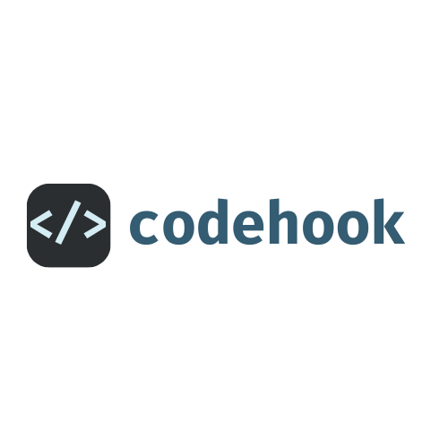

<a name="readme-top"></a>


<!-- PROJECT SHIELDS -->
<!--
*** I'm using markdown "reference style" links for readability.
*** Reference links are enclosed in brackets [ ] instead of parentheses ( ).
*** See the bottom of this document for the declaration of the reference variables
*** for contributors-url, forks-url, etc. This is an optional, concise syntax you may use.
*** https://www.markdownguide.org/basic-syntax/#reference-style-links
-->
[![Contributors][contributors-shield]][contributors-url]
[![Forks][forks-shield]][forks-url]
[![Stargazers][stars-shield]][stars-url]
[![Issues][issues-shield]][issues-url]
[![MIT License][license-shield]][license-url]
[![LinkedIn][linkedin-shield]][linkedin-url]


<!-- PROJECT LOGO -->
<br />
<div align="center">
  <a href="https://github.com/edujanicas/codehook">
    
  </a>

<h3 align="center">codehook</h3>

  <p align="center">
    Webhook logic and infrastructure automated
    <br />
    <a href="https://github.com/edujanicas/codehook"><strong>Explore the docs »</strong></a>
    <br />
    <br />
    <a href="https://github.com/edujanicas/codehook">View Demo</a>
    ·
    <a href="https://github.com/edujanicas/codehook/issues">Report Bug</a>
    ·
    <a href="https://github.com/edujanicas/codehook/issues">Request Feature</a>
  </p>
</div>


<!-- TABLE OF CONTENTS -->
<details>
  <summary>Table of Contents</summary>
  <ol>
    <li>
      <a href="#about-the-project">About The Project</a>
      <ul>
        <li><a href="#built-with">Built With</a></li>
      </ul>
    </li>
    <li>
      <a href="#getting-started">Getting Started</a>
      <ul>
        <li><a href="#prerequisites">Prerequisites</a></li>
        <li><a href="#installation">Installation</a></li>
      </ul>
    </li>
    <li><a href="#usage">Usage</a></li>
    <li><a href="#roadmap">Roadmap</a></li>
    <li><a href="#contributing">Contributing</a></li>
    <li><a href="#license">License</a></li>
    <li><a href="#contact">Contact</a></li>
    <li><a href="#acknowledgments">Acknowledgments</a></li>
  </ol>
</details>


<!-- ABOUT THE PROJECT -->
## About The Project

[![Product Name Screen Shot][product-screenshot]](https://codehook.ai)

There are many ways to extend the capabilities of your favourite SaaS tools, and webhooks are my favourite. Webhooks are the foundation of modern API development. They enable us to react to changes in our systems, an incoming text message, a successful payment, or that latest pull request no matter our stack. [1](https://webhooks.fyi/)

During my time in Stripe, I found that some users were confortable in getting a handler up and running in 30 minutes, others had to navigate weeks of company approvals to get the infrastructure to run one, and others simply did not know what to do. [2](user survey)

I think this tool will make webhooks easy for everyone, once and for all. Here's why:
- Your time should be focused on creating something amazing, and truly unique business logic. The infra to do it isn't unique
- You shouldn't be doing the same tasks over and over like creating a webhook boilerplate from scratch
- You should be able to run your code in your environments when you have control over then
- You shouldn't be blocked from running your code elsewhere if you want because of company buorocracy

Codehook aims to help you all of the above: an open source tool to help you build, test, deploy and host (optionally) webhook handlers 🚀

<p align="right">(<a href="#readme-top">back to top</a>)</p>


### Built With

[![Python][python.py]][python-url]
[![Typer][typer.py]][typer-url]
[![AWS][aws.py]][aws-url]
[](https://github.com/astral-sh/ruff)

<p align="right">(<a href="#readme-top">back to top</a>)</p>


<!-- GETTING STARTED -->
## Getting Started

To get a local copy up and running follow these simple example steps.

### Prerequisites

Codehook is a Python project that relies heavily on Typer and Boto3, with a few additional dependencies. 

Installing Python is generally easy, and nowadays many Linux and UNIX distributions include a recent Python. If you do need to install Python and aren't confident about the task you can find a few notes on the [BeginnersGuide/Download](https://wiki.python.org/moin/BeginnersGuide/Download) wiki page, but installation is unremarkable on most platforms.


### Configuration

1. Get an AWS API Key at [https://example.com](https://example.com)
2. Get the API Key for your source system, such as Stripe.
3. Make sure to set the following environment variables:
```sh
  AWS_ACCESS_KEY_ID=
  AWS_SECRET_ACCESS_KEY=
  STRIPE_API_KEY=
```

<p align="right">(<a href="#readme-top">back to top</a>)</p>


<!-- USAGE EXAMPLES -->
## Usage

### The simplest case

Create a file named `handler.py` with the following content:

```py
def handler_logic(body):
    return (200, "Hello, codehook!")
```

Run the codehook CLI

```sh
foo@bar:~$ codehook deploy --file handler.py
```

The end of the response will contain information about the endpoint:

```sh
Deployment complete 🚀
Function name: handler
API ID: 123456789
Webhook URL: https:/123456789.execute-api.us-east-1.amazonaws.com/prod/codehook
Webhook ID: we_abcdefghijkl
```

Make a POST request to the endpoint that was just created

```sh
foo@bar:~$ curl -X PUT https://123456789.execute-api.us-east-1.amazonaws.com/prod/codehook | json_pp
```

The body of your response should be:

```json
{
  "body" : "Handler logic skeleton",
  "method" : "POST",
  "status_code" : 200
}
```

Congratulations! You just deployed a live webhook endpoint 🎉 

You can clean up by running 

```sh
foo@bar:~$ codehook delete --all
```

### A slightly more complex example

Your function handler receives a body parameter from the webhook event. 
For this example, create a file named `echo.py` with the following content:

```py
def handler_logic(body):
    return (200, body)
```

Run the codehook CLI. You can specify a function name, and the source for the event. Currently codehook supports 
Stripe webhook events.

```sh
codehook deploy --file echo.py --name echo_function --source stripe --enabled-events '*'
```

Make a POST request to the endpoint that was just created, and pass a request body this time:

```sh
foo@bar:~$ curl -X PUT -H "Content-Type: application/json" -d '{"hello":"codehook"}' \
  https://123456789.execute-api.us-east-1.amazonaws.com/prod/codehook | json_pp
```

The body of your response this time should echo back what you sent:

```json
{
  "body" : "{\"hello\":\"codehook\"}",
  "method" : "PUT",
  "status_code" : 200
}
```

You can also delete your resources one by one by running 

```sh
foo@bar:~$ codehook delete --lambda-function-name echo_function --api-id 123456789
```

_For more examples, please refer to the [Documentation](https://example.com)_

<p align="right">(<a href="#readme-top">back to top</a>)</p>


<!-- ROADMAP -->
## Roadmap

- [ ] Feature 1
- [ ] Feature 2
- [ ] Feature 3
    - [ ] Nested Feature

See the [open issues](https://github.com/edujanicas/codehook/issues) for a full list of proposed features (and known issues).

<p align="right">(<a href="#readme-top">back to top</a>)</p>


<!-- CONTRIBUTING -->
## Contributing

Contributions are what make the open source community such an amazing place to learn, inspire, and create. Any contributions you make are **greatly appreciated**.

If you have a suggestion that would make this better, please fork the repo and create a pull request. You can also simply open an issue with the tag "enhancement".
Don't forget to give the project a star! Thanks again!

1. Clone the Project

```sh
  git clone https://github.com/edujanicas/codehook.git
```

2. Create your Feature Branch

```sh
  git checkout -b feature/AmazingFeature
```

3. Install all the dependencies (Using poetry)

```sh
  poetry install
```

4. Copy `.env.example` into a `.env` file and fill in your API Keys
```sh
  cp .env.example .env
```

5. Run the CLI locally

```sh
  poetry run codehook [COMMAND]
```

6. Commit your Changes

```sh
  git commit -m 'Add some AmazingFeature'
```

7. Push to the Branch

```sh
  git push origin feature/AmazingFeature
```

8. Open a Pull Request

<p align="right">(<a href="#readme-top">back to top</a>)</p>


<!-- LICENSE -->
## License

Distributed under the MIT License. See `LICENSE.txt` for more information.

<p align="right">(<a href="#readme-top">back to top</a>)</p>


<!-- CONTACT -->
## Contact

Your Name - [@twitter_handle](https://twitter.com/twitter_handle) - edujanicas@icloud.com

Project Link: [https://github.com/edujanicas/codehook](https://github.com/edujanicas/codehook)

<p align="right">(<a href="#readme-top">back to top</a>)</p>


<!-- ACKNOWLEDGMENTS -->
## Acknowledgments

* []()
* []()
* []()

<p align="right">(<a href="#readme-top">back to top</a>)</p>


<!-- MARKDOWN LINKS & IMAGES -->
<!-- https://www.markdownguide.org/basic-syntax/#reference-style-links -->
[contributors-shield]: https://img.shields.io/github/contributors/edujanicas/codehook.svg?style=for-the-badge
[contributors-url]: https://github.com/edujanicas/codehook/graphs/contributors
[forks-shield]: https://img.shields.io/github/forks/edujanicas/codehook.svg?style=for-the-badge
[forks-url]: https://github.com/edujanicas/codehook/network/members
[stars-shield]: https://img.shields.io/github/stars/edujanicas/codehook.svg?style=for-the-badge
[stars-url]: https://github.com/edujanicas/codehook/stargazers
[issues-shield]: https://img.shields.io/github/issues/edujanicas/codehook.svg?style=for-the-badge
[issues-url]: https://github.com/edujanicas/codehook/issues
[license-shield]: https://img.shields.io/github/license/edujanicas/codehook.svg?style=for-the-badge
[license-url]: https://github.com/edujanicas/codehook/blob/master/LICENSE.txt
[linkedin-shield]: https://img.shields.io/badge/-LinkedIn-black.svg?style=for-the-badge&logo=linkedin&colorB=555
[linkedin-url]: https://linkedin.com/in/edujanicas
[product-screenshot]: images/screenshot.png
[python.py]: https://img.shields.io/badge/python-yellow
[python-url]: https://python.org/
[typer.py]: https://img.shields.io/badge/typer-black
[typer-url]: https://https://typer.tiangolo.com/
[aws.py]: https://img.shields.io/badge/aws-orange
[aws-url]: https://aws.amazon.com/